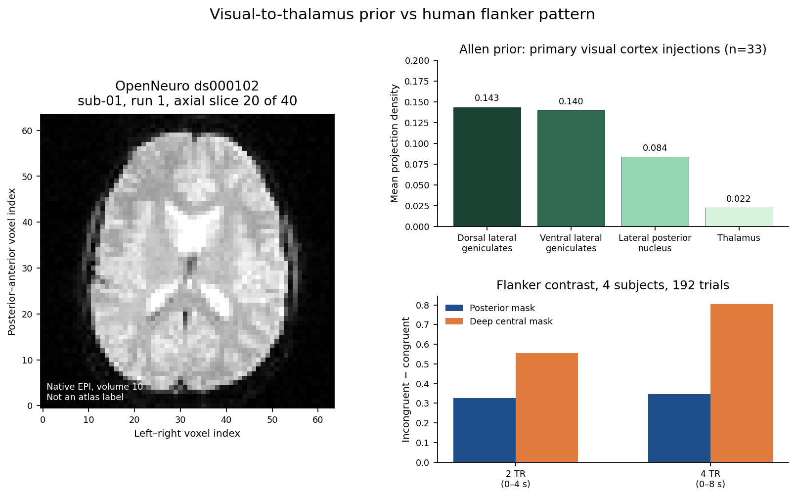

# Flanker task versus the Allen visual-to-thalamus projection

Tested whether congruent versus incongruent patterns in a public human flanker task line up with the Allen mouse projection from the primary visual cortex to the thalamus.

OpenNeuro ds000102 supplied the runs. The events file marked congruent versus incongruent. Region means were taken from a posterior mask and a deep central mask in native space, over 2 TRs and 4 TRs after the marker. NumPy stored the scan matrix and the density vector. SciPy filtered the series and ran the contrast.

The scan matrix was 64×64×40×146, four subjects, both runs, 192 trials. At 2 TRs, incongruent minus congruent was +0.33 in the posterior mask (p=0.14) and +0.56 in the deep central mask (p=0.20). At 4 TRs it was +0.35 in the posterior mask (p=0.063) and +0.81 in the deep central mask (p=0.017).

Allen projection density from primary visual cortex was 0.143 in the dorsal lateral geniculate, 0.140 in the ventral lateral geniculate, 0.084 in the lateral posterior nucleus, and 0.022 in thalamus.

Conclusion: they do not line up. The posterior contrast was weak at both windows. The only nominal effect was in the deep central mask at 4 TRs, and that mask is not an atlas thalamus label.

Data: OpenNeuro ds000102; Allen Mouse Brain Connectivity Atlas.

## Figure

The orange bars are larger. That is not a thalamic finding. The deep central mask is native-space tissue, not an atlas label for thalamus. The posterior mask is the visual-cortex stand-in, and its contrast is weak at both windows.

Caption: left, OpenNeuro ds000102 sub-01 run 1, axial slice 20 of 40, native echo-planar imaging, not an atlas label. Top right, Allen prior from 33 wild-type primary visual cortex injections: dorsal lateral geniculate 0.143, ventral lateral geniculate 0.140, lateral posterior nucleus 0.084, thalamus 0.022. Bottom right, incongruent minus congruent in four subjects and 192 trials. Posterior mask +0.33 at 2 TRs (p=0.14) and +0.35 at 4 TRs (p=0.063). Deep central mask +0.56 at 2 TRs (p=0.20) and +0.81 at 4 TRs (p=0.017). The tall orange bar is the nominal deep-central effect, not evidence that the patterns line up.
